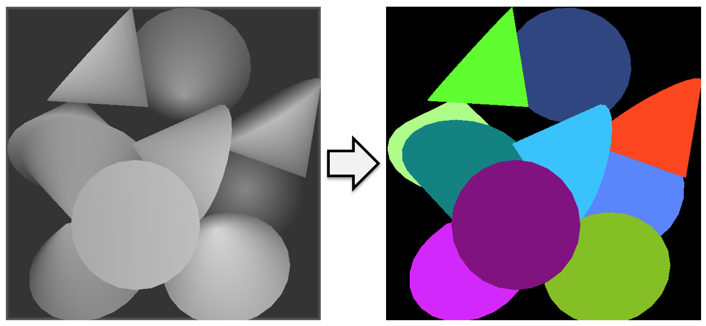

<!--
Copyright (C) 2021-2022 Mitsubishi Electric Research Laboratories (MERL)

SPDX-License-Identifier: AGPL-3.0-or-later
-->

# InSeGAN: A Generative Approach to Segmenting Identical Instances in Depth Images



## Overview

This repository contains training and testing code reported in the ICCV 2021 paper ***InSeGAN: A Generative Approach to Segmenting Identical Instances in Depth Images by Anoop Cherian, Gon\c{c}alo Dias, Siddarth Jain, Tim K. Marks, and Alan Sullivan***.

## Dependencies
Python 3.8.8 <br>
torch==1.6.0 <br>
torchvision==0.7.0 <br>
numpy==1.20.1 <br>
torchgeometry==0.1.2<br>

For any other dependency/version issues, please contact **cherian@merl.com**.<br>
This package contains third-party software components as listed below, governed by the license(s) in the LICENSES folder"

## Training and Test Command Lines

To run the code, below is a sample command line:

### Training command line:
python insegan_main.py --root_dir ./insegan_iccv_data --obj bolt --dthresh -0.3

### Test command line:
python insegan_main.py --root_dir ./insegan_iccv_data --obj bolt --dthresh -0.3 --test

### Arguments:
--root_dir: this argument points to the folder in which the data is stored. The code assumes the following file structure:
&lt;root_dir&gt;/&lt;insta-10-class&gt;/&lt;depth&gt;<br>
&lt;root_dir&gt;/&lt;insta-10-class&gt;/&lt;test&gt;/&lt;rgb&gt;<br>
&lt;root_dir&gt;/&lt;insta-10-class&gt;/&lt;test&gt;/&lt;depth&gt;<br>
&lt;root_dir&gt;/&lt;insta-10-class&gt;/&lt;val&gt;/&lt;rgb&gt;<br>
&lt;root_dir&gt;/&lt;insta-10-class&gt;/&lt;val&gt;/&lt;depth&gt;<br>
where &lt;insta-10-class&gt; is the object class in the Insta-10 dataset on which the model is learned, as specified by --obj argument.
&lt;depth&gt; will have all the training depth images for &lt;insta-10-class&gt; and &lt;test&gt; will have
the val/test depth images in &lt;val/test&gt;/&lt;depth&gt; and their ground truth segmentations in &lt;val/test&gt;/&lt;rgb&gt; for evaluation.

--obj: will point to the respective data class. That is, root_dir/bolt will have all the
data files related to the bolt class.

--dthresh: this is the threshold to use during validation/evaluation. This might need some tuning on the validation set as different objects will need specific depth thresholds (depending on their size and depth of the bin during training). Below are some example thersholds for a subset of the object classes that we use.

|Obj    | bolt  | p_stoper | obj_01 | nut    | cylinder | obj_14 |
| :---  | :---: | :---:    |  :---: | :---:  | :---:    | :---: |
|Epoch  | 150   | 150      | 200    | 250    | 250      | 250   |
|Thresh | -0.3  | 0.3      | 0.0    | 0.0    | 1.0      | 0.3   |

--num_epochs: the number of epochs of the algorithm to be run. Some example numbers are provided above.

--inst: number of instances assumed to be in each image (this is 5 for insta-10 classes).

--seed: an experiment number to use, if some experiment needs to be repeated or resumed. For the latter, use --resume to restart from a previous checkpoint. If seed is not provided, a random seed will be chosen and will be printed in the console.

--source_seed: The code allows for partial training of the model using one seed, and then train with a different setting from a checkpoint using another seed. In this case, use --source_seed to provide the seed used for the first training, and seed to define the continued training.

--no_EL2/--no_EL3: controls which of the losses are used in training. The former is for not including the pose alignment and the latter is for not including the intermediate feature consistency.

--test: for evaluation of a trained model.

--align: what type of 3D pose alignment to use? Options are enumerate/greedy/OT. 'enumerate' will do a full enumeration of the permutations of the instances and selects the best one for computing the loss over. For number of instances more than 6, this method could be slow, and OT will work best.

--num_workers: for the number of worker threads to use in the data loader.

--resume: continue training from a previous checkpoint.

Please refer to args.py to see other arguments to the code.

## Outputs
Output segmentations and sample visualizations will be stored in ./results/ folder.
Specifically, in args.experiment, the following files will be generated during training.

1) inputs_and_generated_samples-&lt;seed&gt;-&lt;obj&gt;.png : evaluates quality of generator<br>
2) best_inputs_and_generated_samples-&lt;seed&gt;-&lt;obj&gt;.png<br>
3) single_generated_samples-&lt;seed&gt;-&lt;obj&gt;.png : evaluates disentanglement of instances.<br>
4) best_single_generated_samples-&lt;seed&gt;-&lt;obj&gt;.png<br>
5) inputs_and_decoded_inputs-&lt;seed&gt;-&lt;obj&gt;.png : evaluates quality of encoder.<br>
6) best_inputs_and_decoded_inputs-&lt;seed&gt;-&lt;obj&gt;.png<br>
7) best_inputs_and_decoded_inputs-&lt;seed&gt;-&lt;obj&gt;.npy: if one needs npy instead of png.
Further, images from very epoch are stored in &lt;args.experiment&gt;/all/... folder.
8) At inference, the following file is generated for all the depth images in the test set.<br> inputs_and_decoded_inputs-&lt;seed&gt;-&lt;obj&gt;-qual-paper.png<br>

### Trained models:
The trained model are saved in the folder specified in args.experiment. There will be three files: ckpt_netG.pth, ckpt_netD.pth, and ckpt_netE.pth, corresponding to the best models (using the validation set) for the generator, the discriminator, and the pose encoder.

## Contact

Anoop Cherian: cherian@merl.com

## Citation

If you use this code, please cite the following paper:

```
@InProceedings{Cherian_2021_ICCV,
    author    = {Cherian, Anoop and Pais, Gon\c{c}alo Dias and Jain, Siddarth and Marks, Tim K. and Sullivan, Alan},
    title     = {InSeGAN: A Generative Approach to Segmenting Identical Instances in Depth Images},
    booktitle = {Proceedings of the IEEE/CVF International Conference on Computer Vision (ICCV)},
    month     = {October},
    year      = {2021},
    pages     = {10023-10032}
}
```

## Copyright and License

Released under `AGPL-3.0-or-later` license, as found in the [LICENSE.md](LICENSE.md) file.

All files, except `Hologan.py`:

```
Copyright (c) 2021,2022 Mitsubishi Electric Research Laboratories (MERL)

SPDX-License-Identifier: AGPL-3.0-or-later
```

`Hologan.py` was adapted from https://github.com/christopher-beckham/hologan-pytorch/blob/master/hologan.py (BSD-3-Clause license: see [LICENSES/BSD-3-Clause.md](LICENSES/BSD-3-Clause.md)):

```
Copyright (c) 2021,2022 Mitsubishi Electric Research Laboratories (MERL)
Copyright (c) 2019, Christopher Beckham

SPDX-License-Identifier: AGPL-3.0-or-later
SPDX-License-Identifier: BSD-3-Clause
```
